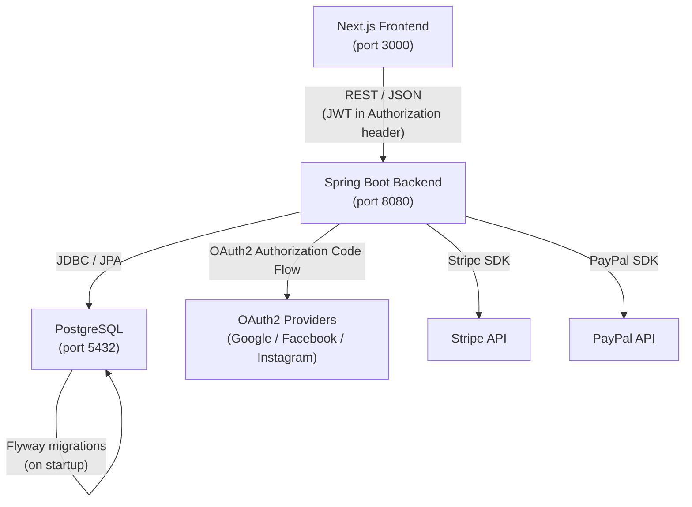
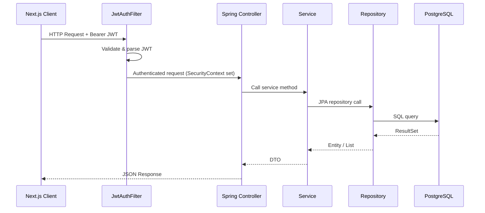
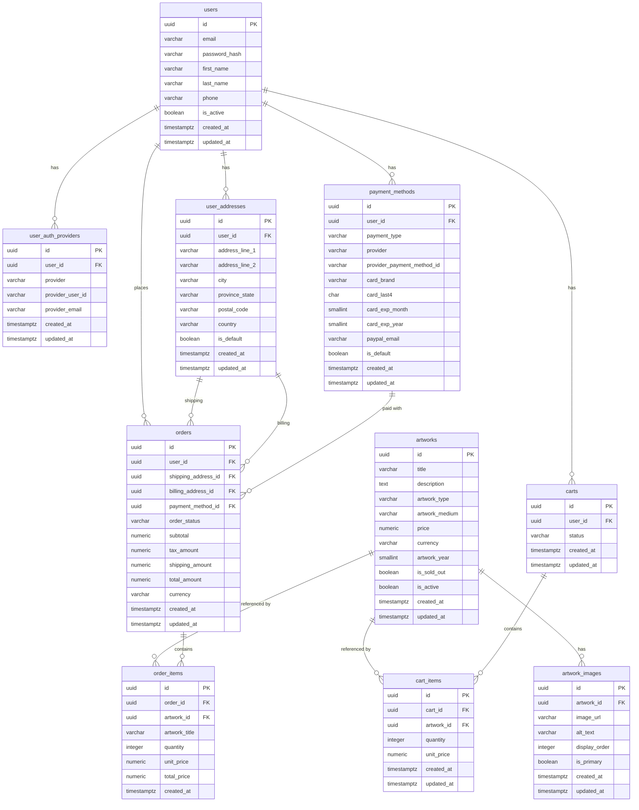
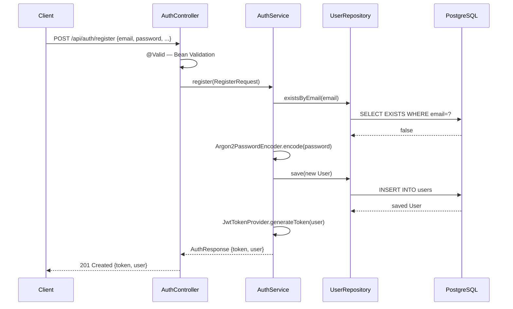
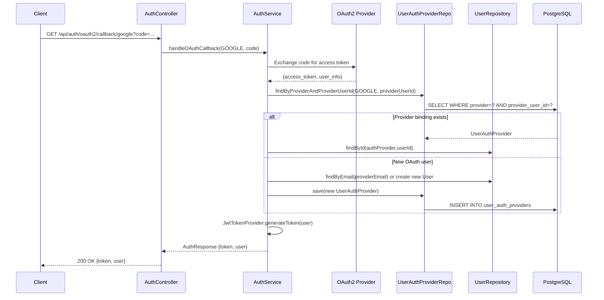
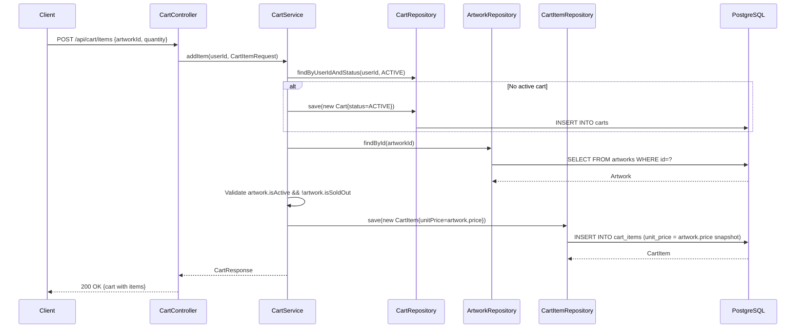
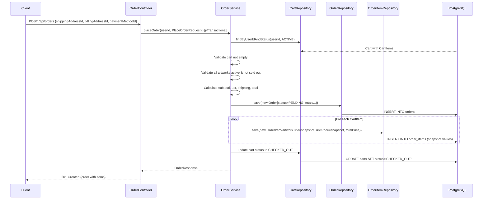

# Design Document: Backend Database

## Overview

This document describes the technical design for the art gallery e-commerce backend database layer. The system is a Spring Boot application backed by a PostgreSQL database, with Flyway managing all schema migrations. The backend exposes a REST API consumed by the Next.js frontend.

The design covers:
- Flyway migration file structure and execution strategy
- Full PostgreSQL schema for all 10 tables
- Spring Boot project structure (packages, layers)
- JPA entity models
- Repository, service, and controller layers
- Security design (JWT authentication, password hashing, OAuth2)
- Data flow for key operations

### Key Design Decisions

| Decision | Choice | Rationale |
|---|---|---|
| Password hashing | Argon2id (`Argon2PasswordEncoder`) | Winner of Password Hashing Competition 2015; recommended by Spring Security docs for new applications; stronger GPU resistance than BCrypt |
| Authentication tokens | Stateless JWT (HS256) | Fits a Next.js SPA; no server-side session storage needed; standard for REST APIs |
| UUID generation | Application-side via Hibernate 6 `GenerationType.UUID` | Avoids round-trip to DB for ID; compatible with distributed environments |
| Enum storage | `VARCHAR` + `CHECK` constraint | Readable in DB tooling; constraint enforced at DB level per requirements |
| Timestamp type | `TIMESTAMPTZ` | Consistent UTC storage regardless of server timezone |
| Monetary values | `NUMERIC(10,2)` | Exact decimal arithmetic; no floating-point rounding errors |
| Currency | CAD default | Gallery operates in Canadian dollars |

---

## Architecture



### Request Lifecycle



---

## Components and Interfaces

### Spring Boot Package Structure

```
com.artgallery
├── config/
│   ├── SecurityConfig.java          # SecurityFilterChain, CORS, CSRF
│   ├── JwtConfig.java               # JWT secret, expiry properties
│   └── FlywayConfig.java            # (optional) custom Flyway callbacks
├── security/
│   ├── JwtTokenProvider.java        # Generate, validate, parse JWT
│   ├── JwtAuthenticationFilter.java # OncePerRequestFilter — reads Bearer token
│   └── UserDetailsServiceImpl.java  # Loads UserDetails from DB
├── domain/
│   ├── user/
│   │   ├── User.java                # @Entity
│   │   ├── UserAuthProvider.java    # @Entity
│   │   ├── UserAddress.java         # @Entity
│   │   └── PaymentMethod.java       # @Entity
│   ├── artwork/
│   │   ├── Artwork.java             # @Entity
│   │   └── ArtworkImage.java        # @Entity
│   ├── cart/
│   │   ├── Cart.java                # @Entity
│   │   └── CartItem.java            # @Entity
│   └── order/
│       ├── Order.java               # @Entity
│       └── OrderItem.java           # @Entity
├── repository/
│   ├── UserRepository.java
│   ├── UserAuthProviderRepository.java
│   ├── UserAddressRepository.java
│   ├── PaymentMethodRepository.java
│   ├── ArtworkRepository.java
│   ├── ArtworkImageRepository.java
│   ├── CartRepository.java
│   ├── CartItemRepository.java
│   ├── OrderRepository.java
│   └── OrderItemRepository.java
├── service/
│   ├── AuthService.java
│   ├── UserService.java
│   ├── AddressService.java
│   ├── PaymentMethodService.java
│   ├── ArtworkService.java
│   ├── CartService.java
│   └── OrderService.java
├── controller/
│   ├── AuthController.java          # POST /api/auth/**
│   ├── UserController.java          # GET /api/users/me
│   ├── AddressController.java       # /api/addresses/**
│   ├── PaymentMethodController.java # /api/payment-methods/**
│   ├── ArtworkController.java       # GET /api/artworks/**
│   ├── CartController.java          # /api/cart/**
│   └── OrderController.java         # /api/orders/**
├── dto/
│   ├── request/
│   │   ├── RegisterRequest.java
│   │   ├── LoginRequest.java
│   │   ├── AddressRequest.java
│   │   ├── PaymentMethodRequest.java
│   │   ├── CartItemRequest.java
│   │   └── PlaceOrderRequest.java
│   └── response/
│       ├── AuthResponse.java
│       ├── UserResponse.java
│       ├── AddressResponse.java
│       ├── PaymentMethodResponse.java
│       ├── ArtworkResponse.java
│       ├── CartResponse.java
│       └── OrderResponse.java
└── exception/
    ├── GlobalExceptionHandler.java  # @RestControllerAdvice
    ├── ResourceNotFoundException.java
    ├── ConflictException.java
    └── UnauthorizedException.java
```

### Flyway Migration File Structure

All migration files live in `src/main/resources/db/migration/` and follow the naming convention `V{n}__{description}.sql`.

```
src/main/resources/db/migration/
├── V1__create_users_table.sql
├── V2__create_user_auth_providers_table.sql
├── V3__create_user_addresses_table.sql
├── V4__create_payment_methods_table.sql
├── V5__create_artworks_table.sql
├── V6__create_artwork_images_table.sql
├── V7__create_carts_table.sql
├── V8__create_cart_items_table.sql
├── V9__create_orders_table.sql
└── V10__create_order_items_table.sql
```

Each migration is idempotent in the sense that Flyway tracks applied versions in `flyway_schema_history` and will never re-execute a migration whose checksum is already recorded. If a migration fails, Spring Boot startup halts and logs the error.

### REST API Endpoint Map

| Method | Path | Auth | Description |
|---|---|---|---|
| POST | `/api/auth/register` | Public | Register with email + password |
| POST | `/api/auth/login` | Public | Login, returns JWT |
| GET | `/api/auth/oauth2/callback/{provider}` | Public | OAuth2 callback handler |
| GET | `/api/users/me` | JWT | Get current user profile |
| GET | `/api/addresses` | JWT | List user's addresses |
| POST | `/api/addresses` | JWT | Create address |
| PUT | `/api/addresses/{id}` | JWT | Update address |
| DELETE | `/api/addresses/{id}` | JWT | Delete address |
| GET | `/api/payment-methods` | JWT | List user's payment methods |
| POST | `/api/payment-methods` | JWT | Add payment method |
| PUT | `/api/payment-methods/{id}` | JWT | Update payment method |
| DELETE | `/api/payment-methods/{id}` | JWT | Delete payment method |
| GET | `/api/artworks` | Public | List artworks (with filters) |
| GET | `/api/artworks/{id}` | Public | Get artwork detail |
| GET | `/api/cart` | JWT | Get active cart |
| POST | `/api/cart/items` | JWT | Add item to cart |
| PUT | `/api/cart/items/{itemId}` | JWT | Update cart item quantity |
| DELETE | `/api/cart/items/{itemId}` | JWT | Remove cart item |
| POST | `/api/orders` | JWT | Place order from active cart |
| GET | `/api/orders` | JWT | List user's orders |
| GET | `/api/orders/{id}` | JWT | Get order detail with items |

---

## Data Models

### PostgreSQL Schema

#### V1 — users

```sql
CREATE EXTENSION IF NOT EXISTS "pgcrypto";

CREATE TABLE users (
    id              UUID            PRIMARY KEY DEFAULT gen_random_uuid(),
    email           VARCHAR(255)    NOT NULL,
    password_hash   VARCHAR(255),
    first_name      VARCHAR(100),
    last_name       VARCHAR(100),
    phone           VARCHAR(30),
    is_active       BOOLEAN         NOT NULL DEFAULT TRUE,
    created_at      TIMESTAMPTZ     NOT NULL DEFAULT NOW(),
    updated_at      TIMESTAMPTZ     NOT NULL DEFAULT NOW(),
    CONSTRAINT uq_users_email UNIQUE (email)
);
```

#### V2 — user_auth_providers

```sql
CREATE TABLE user_auth_providers (
    id                  UUID            PRIMARY KEY DEFAULT gen_random_uuid(),
    user_id             UUID            NOT NULL,
    provider            VARCHAR(30)     NOT NULL,
    provider_user_id    VARCHAR(255)    NOT NULL,
    provider_email      VARCHAR(255),
    created_at          TIMESTAMPTZ     NOT NULL DEFAULT NOW(),
    updated_at          TIMESTAMPTZ     NOT NULL DEFAULT NOW(),
    CONSTRAINT fk_auth_providers_user
        FOREIGN KEY (user_id) REFERENCES users(id) ON DELETE CASCADE,
    CONSTRAINT uq_auth_providers_provider_user
        UNIQUE (provider, provider_user_id),
    CONSTRAINT chk_auth_providers_provider
        CHECK (provider IN ('GOOGLE', 'FACEBOOK', 'INSTAGRAM'))
);
```

#### V3 — user_addresses

```sql
CREATE TABLE user_addresses (
    id              UUID            PRIMARY KEY DEFAULT gen_random_uuid(),
    user_id         UUID            NOT NULL,
    address_line_1  VARCHAR(255)    NOT NULL,
    address_line_2  VARCHAR(255),
    city            VARCHAR(100)    NOT NULL,
    province_state  VARCHAR(100)    NOT NULL,
    postal_code     VARCHAR(20)     NOT NULL,
    country         VARCHAR(100)    NOT NULL,
    is_default      BOOLEAN         NOT NULL DEFAULT FALSE,
    created_at      TIMESTAMPTZ     NOT NULL DEFAULT NOW(),
    updated_at      TIMESTAMPTZ     NOT NULL DEFAULT NOW(),
    CONSTRAINT fk_addresses_user
        FOREIGN KEY (user_id) REFERENCES users(id) ON DELETE CASCADE
);
```

#### V4 — payment_methods

```sql
CREATE TABLE payment_methods (
    id                          UUID        PRIMARY KEY DEFAULT gen_random_uuid(),
    user_id                     UUID        NOT NULL,
    payment_type                VARCHAR(20) NOT NULL,
    provider                    VARCHAR(20) NOT NULL,
    provider_payment_method_id  VARCHAR(255),
    card_brand                  VARCHAR(30),
    card_last4                  CHAR(4),
    card_exp_month              SMALLINT,
    card_exp_year               SMALLINT,
    paypal_email                VARCHAR(255),
    is_default                  BOOLEAN     NOT NULL DEFAULT FALSE,
    created_at                  TIMESTAMPTZ NOT NULL DEFAULT NOW(),
    updated_at                  TIMESTAMPTZ NOT NULL DEFAULT NOW(),
    CONSTRAINT fk_payment_methods_user
        FOREIGN KEY (user_id) REFERENCES users(id) ON DELETE CASCADE,
    CONSTRAINT chk_payment_type
        CHECK (payment_type IN ('CREDIT_CARD', 'DEBIT_CARD', 'STRIPE', 'PAYPAL')),
    CONSTRAINT chk_payment_provider
        CHECK (provider IN ('STRIPE', 'PAYPAL', 'MANUAL'))
);
```

> No `card_number` or `cvv` column exists anywhere in the schema. Full card data is never stored.

#### V5 — artworks

```sql
CREATE TABLE artworks (
    id              UUID            PRIMARY KEY DEFAULT gen_random_uuid(),
    title           VARCHAR(255)    NOT NULL,
    description     TEXT,
    artwork_type    VARCHAR(50),
    artwork_medium  VARCHAR(100),
    price           NUMERIC(10,2)   NOT NULL,
    currency        VARCHAR(10)     NOT NULL DEFAULT 'CAD',
    artwork_year    SMALLINT,
    is_sold_out     BOOLEAN         NOT NULL DEFAULT FALSE,
    is_active       BOOLEAN         NOT NULL DEFAULT TRUE,
    created_at      TIMESTAMPTZ     NOT NULL DEFAULT NOW(),
    updated_at      TIMESTAMPTZ     NOT NULL DEFAULT NOW(),
    CONSTRAINT chk_artwork_year
        CHECK (artwork_year IN (2024, 2025, 2026))
);

CREATE INDEX idx_artworks_type        ON artworks(artwork_type);
CREATE INDEX idx_artworks_medium      ON artworks(artwork_medium);
CREATE INDEX idx_artworks_year        ON artworks(artwork_year);
CREATE INDEX idx_artworks_is_sold_out ON artworks(is_sold_out);
CREATE INDEX idx_artworks_is_active   ON artworks(is_active);
```

#### V6 — artwork_images

```sql
CREATE TABLE artwork_images (
    id              UUID            PRIMARY KEY DEFAULT gen_random_uuid(),
    artwork_id      UUID            NOT NULL,
    image_url       VARCHAR(2048)   NOT NULL,
    alt_text        VARCHAR(255),
    display_order   INTEGER         NOT NULL DEFAULT 0,
    is_primary      BOOLEAN         NOT NULL DEFAULT FALSE,
    created_at      TIMESTAMPTZ     NOT NULL DEFAULT NOW(),
    updated_at      TIMESTAMPTZ     NOT NULL DEFAULT NOW(),
    CONSTRAINT fk_artwork_images_artwork
        FOREIGN KEY (artwork_id) REFERENCES artworks(id) ON DELETE CASCADE
);
```

#### V7 — carts

```sql
CREATE TABLE carts (
    id          UUID        PRIMARY KEY DEFAULT gen_random_uuid(),
    user_id     UUID        NOT NULL,
    status      VARCHAR(20) NOT NULL DEFAULT 'ACTIVE',
    created_at  TIMESTAMPTZ NOT NULL DEFAULT NOW(),
    updated_at  TIMESTAMPTZ NOT NULL DEFAULT NOW(),
    CONSTRAINT fk_carts_user
        FOREIGN KEY (user_id) REFERENCES users(id) ON DELETE CASCADE,
    CONSTRAINT chk_cart_status
        CHECK (status IN ('ACTIVE', 'CHECKED_OUT', 'ABANDONED'))
);
```

#### V8 — cart_items

```sql
CREATE TABLE cart_items (
    id          UUID            PRIMARY KEY DEFAULT gen_random_uuid(),
    cart_id     UUID            NOT NULL,
    artwork_id  UUID            NOT NULL,
    quantity    INTEGER         NOT NULL DEFAULT 1,
    unit_price  NUMERIC(10,2)   NOT NULL,
    created_at  TIMESTAMPTZ     NOT NULL DEFAULT NOW(),
    updated_at  TIMESTAMPTZ     NOT NULL DEFAULT NOW(),
    CONSTRAINT fk_cart_items_cart
        FOREIGN KEY (cart_id) REFERENCES carts(id) ON DELETE CASCADE,
    CONSTRAINT fk_cart_items_artwork
        FOREIGN KEY (artwork_id) REFERENCES artworks(id),
    CONSTRAINT uq_cart_items_cart_artwork
        UNIQUE (cart_id, artwork_id)
);
```

#### V9 — orders

```sql
CREATE TABLE orders (
    id                  UUID            PRIMARY KEY DEFAULT gen_random_uuid(),
    user_id             UUID            NOT NULL,
    shipping_address_id UUID            NOT NULL,
    billing_address_id  UUID            NOT NULL,
    payment_method_id   UUID            NOT NULL,
    order_status        VARCHAR(20)     NOT NULL,
    subtotal            NUMERIC(10,2)   NOT NULL,
    tax_amount          NUMERIC(10,2)   NOT NULL,
    shipping_amount     NUMERIC(10,2)   NOT NULL,
    total_amount        NUMERIC(10,2)   NOT NULL,
    currency            VARCHAR(10)     NOT NULL DEFAULT 'CAD',
    created_at          TIMESTAMPTZ     NOT NULL DEFAULT NOW(),
    updated_at          TIMESTAMPTZ     NOT NULL DEFAULT NOW(),
    CONSTRAINT fk_orders_user
        FOREIGN KEY (user_id) REFERENCES users(id),
    CONSTRAINT fk_orders_shipping_address
        FOREIGN KEY (shipping_address_id) REFERENCES user_addresses(id),
    CONSTRAINT fk_orders_billing_address
        FOREIGN KEY (billing_address_id) REFERENCES user_addresses(id),
    CONSTRAINT fk_orders_payment_method
        FOREIGN KEY (payment_method_id) REFERENCES payment_methods(id),
    CONSTRAINT chk_order_status
        CHECK (order_status IN ('PENDING','PAID','PROCESSING','SHIPPED','DELIVERED','CANCELLED','REFUNDED'))
);

CREATE INDEX idx_orders_user_id ON orders(user_id);
```

#### V10 — order_items

```sql
CREATE TABLE order_items (
    id              UUID            PRIMARY KEY DEFAULT gen_random_uuid(),
    order_id        UUID            NOT NULL,
    artwork_id      UUID            NOT NULL,
    artwork_title   VARCHAR(255)    NOT NULL,
    quantity        INTEGER         NOT NULL,
    unit_price      NUMERIC(10,2)   NOT NULL,
    total_price     NUMERIC(10,2)   NOT NULL,
    created_at      TIMESTAMPTZ     NOT NULL DEFAULT NOW(),
    CONSTRAINT fk_order_items_order
        FOREIGN KEY (order_id) REFERENCES orders(id) ON DELETE CASCADE,
    CONSTRAINT fk_order_items_artwork
        FOREIGN KEY (artwork_id) REFERENCES artworks(id)
);

CREATE INDEX idx_order_items_order_id ON order_items(order_id);
```

### Entity Relationship Diagram



### JPA Entity Design

All entities follow the same base pattern:

```java
// Base class (optional — can be inlined per entity)
@MappedSuperclass
public abstract class BaseEntity {
    @Id
    @GeneratedValue(strategy = GenerationType.UUID)
    @Column(columnDefinition = "uuid", updatable = false, nullable = false)
    private UUID id;

    @Column(name = "created_at", nullable = false, updatable = false)
    private OffsetDateTime createdAt;

    @Column(name = "updated_at", nullable = false)
    private OffsetDateTime updatedAt;

    @PrePersist
    protected void onCreate() {
        createdAt = OffsetDateTime.now(ZoneOffset.UTC);
        updatedAt = OffsetDateTime.now(ZoneOffset.UTC);
    }

    @PreUpdate
    protected void onUpdate() {
        updatedAt = OffsetDateTime.now(ZoneOffset.UTC);
    }
}
```

Key entity annotations:

```java
// User.java
@Entity
@Table(name = "users")
public class User extends BaseEntity {
    @Column(unique = true, nullable = false)
    private String email;

    @Column(name = "password_hash")
    private String passwordHash;  // nullable — OAuth-only users have no password

    // ... other fields
    @OneToMany(mappedBy = "user", cascade = CascadeType.ALL, orphanRemoval = true)
    private List<UserAuthProvider> authProviders = new ArrayList<>();
}

// UserAuthProvider.java
@Entity
@Table(name = "user_auth_providers",
    uniqueConstraints = @UniqueConstraint(columnNames = {"provider", "provider_user_id"}))
public class UserAuthProvider extends BaseEntity {
    @ManyToOne(fetch = FetchType.LAZY)
    @JoinColumn(name = "user_id", nullable = false)
    private User user;

    @Enumerated(EnumType.STRING)
    @Column(nullable = false, length = 30)
    private OAuthProvider provider;  // enum: GOOGLE, FACEBOOK, INSTAGRAM

    @Column(name = "provider_user_id", nullable = false)
    private String providerUserId;
}

// Artwork.java
@Entity
@Table(name = "artworks")
public class Artwork extends BaseEntity {
    @Column(nullable = false)
    private String title;

    @Column(precision = 10, scale = 2, nullable = false)
    private BigDecimal price;

    @Column(nullable = false, length = 10)
    private String currency = "CAD";

    @Column(name = "artwork_year")
    private Short artworkYear;  // CHECK constraint enforced at DB level

    @Column(name = "is_sold_out", nullable = false)
    private boolean soldOut = false;

    @OneToMany(mappedBy = "artwork", cascade = CascadeType.ALL, orphanRemoval = true)
    @OrderBy("displayOrder ASC")
    private List<ArtworkImage> images = new ArrayList<>();
}

// CartItem.java — price snapshot at add time
@Entity
@Table(name = "cart_items",
    uniqueConstraints = @UniqueConstraint(columnNames = {"cart_id", "artwork_id"}))
public class CartItem extends BaseEntity {
    @ManyToOne(fetch = FetchType.LAZY)
    @JoinColumn(name = "cart_id", nullable = false)
    private Cart cart;

    @ManyToOne(fetch = FetchType.LAZY)
    @JoinColumn(name = "artwork_id", nullable = false)
    private Artwork artwork;

    @Column(nullable = false)
    private Integer quantity = 1;

    @Column(name = "unit_price", precision = 10, scale = 2, nullable = false)
    private BigDecimal unitPrice;  // snapshot of artwork.price at add time
}

// OrderItem.java — full snapshot of artwork data at order time
@Entity
@Table(name = "order_items")
public class OrderItem {
    @Id
    @GeneratedValue(strategy = GenerationType.UUID)
    @Column(columnDefinition = "uuid", updatable = false)
    private UUID id;

    @ManyToOne(fetch = FetchType.LAZY)
    @JoinColumn(name = "order_id", nullable = false)
    private Order order;

    @ManyToOne(fetch = FetchType.LAZY)
    @JoinColumn(name = "artwork_id", nullable = false)
    private Artwork artwork;

    @Column(name = "artwork_title", nullable = false)
    private String artworkTitle;  // snapshot — preserved even if artwork changes

    @Column(nullable = false)
    private Integer quantity;

    @Column(name = "unit_price", precision = 10, scale = 2, nullable = false)
    private BigDecimal unitPrice;  // snapshot

    @Column(name = "total_price", precision = 10, scale = 2, nullable = false)
    private BigDecimal totalPrice; // unitPrice * quantity, computed at order time

    @Column(name = "created_at", nullable = false, updatable = false)
    private OffsetDateTime createdAt;
}
```

### Repository Layer

All repositories extend `JpaRepository<Entity, UUID>` and add custom query methods as needed:

```java
public interface UserRepository extends JpaRepository<User, UUID> {
    Optional<User> findByEmail(String email);
    boolean existsByEmail(String email);
}

public interface UserAuthProviderRepository extends JpaRepository<UserAuthProvider, UUID> {
    Optional<UserAuthProvider> findByProviderAndProviderUserId(OAuthProvider provider, String providerUserId);
    List<UserAuthProvider> findByUserId(UUID userId);
}

public interface ArtworkRepository extends JpaRepository<Artwork, UUID> {
    // Filtering via Spring Data Specifications (JpaSpecificationExecutor)
    // or a custom @Query for multi-filter support
    Page<Artwork> findAll(Specification<Artwork> spec, Pageable pageable);
}

public interface CartRepository extends JpaRepository<Cart, UUID> {
    Optional<Cart> findByUserIdAndStatus(UUID userId, CartStatus status);
}

public interface OrderRepository extends JpaRepository<Order, UUID> {
    List<Order> findByUserIdOrderByCreatedAtDesc(UUID userId);
}

public interface OrderItemRepository extends JpaRepository<OrderItem, UUID> {
    List<OrderItem> findByOrderId(UUID orderId);
}
```

`ArtworkRepository` implements `JpaSpecificationExecutor<Artwork>` to support dynamic multi-field filtering (type, medium, year, is_sold_out, is_active) without combinatorial query methods.

### Service Layer

```java
// AuthService — registration, login, OAuth
public interface AuthService {
    AuthResponse register(RegisterRequest request);
    AuthResponse login(LoginRequest request);
    AuthResponse handleOAuthCallback(OAuthProvider provider, String code);
}

// CartService — manages the active cart lifecycle
public interface CartService {
    CartResponse getActiveCart(UUID userId);
    CartResponse addItem(UUID userId, CartItemRequest request);
    CartResponse updateItem(UUID userId, UUID itemId, int quantity);
    CartResponse removeItem(UUID userId, UUID itemId);
}

// OrderService — converts cart to order with snapshots
public interface OrderService {
    OrderResponse placeOrder(UUID userId, PlaceOrderRequest request);
    List<OrderResponse> getOrderHistory(UUID userId);
    OrderResponse getOrderDetail(UUID userId, UUID orderId);
}
```

The `OrderService.placeOrder` method executes within a single `@Transactional` block:
1. Load the user's `ACTIVE` cart and its items
2. Validate all artworks are still active and not sold out
3. Create the `Order` record with totals
4. For each `CartItem`, create an `OrderItem` copying `artwork.title`, `cartItem.unitPrice`, and computing `totalPrice`
5. Mark the cart as `CHECKED_OUT`
6. Return the order response

### DTO Design

Request DTOs use Bean Validation annotations:

```java
public record RegisterRequest(
    @Email @NotBlank String email,
    @NotBlank @Size(min = 8) String password,
    String firstName,
    String lastName
) {}

public record LoginRequest(
    @Email @NotBlank String email,
    @NotBlank String password
) {}

public record CartItemRequest(
    @NotNull UUID artworkId,
    @Min(1) int quantity
) {}

public record PlaceOrderRequest(
    @NotNull UUID shippingAddressId,
    @NotNull UUID billingAddressId,
    @NotNull UUID paymentMethodId
) {}
```

Response DTOs never expose `password_hash`, full card numbers, or CVV fields.

---

## Correctness Properties

*A property is a characteristic or behavior that should hold true across all valid executions of a system — essentially, a formal statement about what the system should do. Properties serve as the bridge between human-readable specifications and machine-verifiable correctness guarantees.*


### Property 1: Email Uniqueness

*For any* two user registration attempts using the same email address, the second attempt SHALL always be rejected with a unique constraint violation, regardless of the values of other fields.

**Validates: Requirements 2.2**

---

### Property 2: Password Never Stored in Plaintext

*For any* non-empty password string submitted during registration, the value stored in `users.password_hash` SHALL never equal the original plaintext password string.

**Validates: Requirements 2.4, 9.5, 9.6**

---

### Property 3: Timestamps Auto-Managed on Persist and Update

*For any* entity insert, `created_at` and `updated_at` SHALL be set to a timestamp within a small delta of the current UTC time. *For any* subsequent update to that entity, `updated_at` SHALL be greater than or equal to its previous value, while `created_at` SHALL remain unchanged.

**Validates: Requirements 2.5, 2.6**

---

### Property 4: Foreign Key Integrity Across All Tables

*For any* table that has a foreign key column (e.g., `user_id`, `cart_id`, `artwork_id`, `order_id`, `shipping_address_id`, `billing_address_id`, `payment_method_id`), inserting a row with a UUID value that does not correspond to an existing row in the referenced table SHALL always be rejected with a foreign key constraint violation.

**Validates: Requirements 3.2, 4.2, 5.2, 7.2, 7.5, 7.6, 8.2, 8.3, 8.4, 8.8, 8.9, 9.4**

---

### Property 5: Enum CHECK Constraints Reject Invalid Values

*For any* string value that is not a member of a column's defined enumeration set (`user_auth_providers.provider`, `payment_methods.payment_type`, `payment_methods.provider`, `carts.status`, `orders.order_status`, `artworks.artwork_year`), inserting a row with that value SHALL always be rejected with a check constraint violation.

**Validates: Requirements 3.4, 5.3, 5.4, 6.2, 7.3, 8.5, 9.3**

---

### Property 6: OAuth Provider Binding Uniqueness

*For any* combination of `(provider, provider_user_id)`, inserting a second `user_auth_providers` row with the same combination SHALL always be rejected with a unique constraint violation, regardless of which user the second row is associated with.

**Validates: Requirements 3.3**

---

### Property 7: Cart Item Uniqueness Per Cart

*For any* cart and any artwork, inserting a second `cart_items` row with the same `(cart_id, artwork_id)` combination SHALL always be rejected with a unique constraint violation.

**Validates: Requirements 7.7**

---

### Property 8: Price Snapshot Immutability

*For any* artwork with any price, after a `CartItem` is created the `cart_items.unit_price` SHALL equal the artwork's price at the moment of insertion. Furthermore, after an `Order` is placed from that cart, the `order_items.unit_price`, `order_items.artwork_title`, and `order_items.total_price` SHALL equal the values captured at order-creation time — and SHALL remain unchanged even if the source artwork's price or title is subsequently modified.

**Validates: Requirements 7.8, 8.10**

---

### Property 9: Artwork Filter Correctness

*For any* combination of filter parameters (`artwork_type`, `artwork_medium`, `artwork_year`, `is_sold_out`, `is_active`) applied to the artwork query endpoint, every artwork returned in the result set SHALL satisfy all of the specified filter conditions. No artwork that fails any applied filter condition SHALL appear in the results.

**Validates: Requirements 10.5**

---

### Property 10: Order History Data Isolation

*For any* authenticated user, the order history endpoint SHALL return only orders whose `user_id` matches the authenticated user's ID. Orders belonging to other users SHALL never appear in the response.

**Validates: Requirements 10.8**

---

## Error Handling

### HTTP Error Responses

All errors are returned as structured JSON via `@RestControllerAdvice`:

```json
{
  "timestamp": "2025-01-15T14:30:00Z",
  "status": 400,
  "error": "Bad Request",
  "message": "email: must be a well-formed email address",
  "path": "/api/auth/register"
}
```

### Error Scenarios and HTTP Status Codes

| Scenario | HTTP Status | Exception |
|---|---|---|
| Validation failure (Bean Validation) | 400 | `MethodArgumentNotValidException` |
| Duplicate email on registration | 409 | `ConflictException` |
| Invalid credentials on login | 401 | `UnauthorizedException` |
| JWT missing or invalid | 401 | Spring Security `AuthenticationException` |
| Accessing another user's resource | 403 | `AccessDeniedException` |
| Resource not found (address, order, etc.) | 404 | `ResourceNotFoundException` |
| Invalid enum value in request | 400 | `MethodArgumentNotValidException` |
| Cart is empty on order placement | 422 | `UnprocessableEntityException` |
| Artwork is sold out or inactive | 422 | `UnprocessableEntityException` |
| Database constraint violation | 409 | `DataIntegrityViolationException` → mapped to 409 |
| Flyway migration failure on startup | 500 | Application fails to start; logged to console |

### Security Error Handling

- Expired JWT → 401 with `"Token expired"` message
- Malformed JWT → 401 with `"Invalid token"` message
- Missing `Authorization` header on protected routes → 401
- Attempting to access another user's address/order → 404 (resource not found, to avoid leaking existence)

### Transactional Error Handling

`OrderService.placeOrder` runs in a single `@Transactional` block. If any step fails (e.g., artwork sold out, FK violation), the entire transaction rolls back and no partial order is created.

---

## Testing Strategy

### Overview

The testing strategy uses a dual approach: example-based integration tests for specific scenarios and property-based tests for universal invariants.

### Property-Based Testing Library

**Library**: [jqwik](https://jqwik.net/) — a property-based testing library for Java that integrates with JUnit 5. It is the standard PBT choice for Spring Boot projects.

**Configuration**: Each `@Property` test runs a minimum of **100 tries** (jqwik default). Tests are tagged with the feature and property number for traceability.

```java
// Example property test structure
@Property(tries = 100)
@Label("Feature: backend-database, Property 1: Email uniqueness")
void emailUniqueness(@ForAll @Email String email) {
    // Insert first user — should succeed
    userRepository.save(buildUser(email));
    // Insert second user with same email — should throw
    assertThatThrownBy(() -> userRepository.saveAndFlush(buildUser(email)))
        .isInstanceOf(DataIntegrityViolationException.class);
}
```

### Test Layers

#### Unit Tests (JUnit 5 + Mockito)

Focus on service layer logic in isolation, mocking repositories:

- `AuthService`: registration flow, login flow, JWT generation
- `CartService`: add/update/remove item logic, price snapshot capture
- `OrderService`: order creation logic, snapshot copying, total calculation
- `ArtworkService`: filter specification building
- DTO validation: Bean Validation constraint tests

#### Property-Based Tests (jqwik + Spring Boot Test + Testcontainers)

Each correctness property from the design document maps to one `@Property` test. Tests run against a real PostgreSQL instance via Testcontainers to exercise actual DB constraints.

| Property | Test Class | Tries |
|---|---|---|
| P1: Email uniqueness | `UserRepositoryPropertyTest` | 100 |
| P2: Password never plaintext | `AuthServicePropertyTest` | 100 |
| P3: Timestamps auto-managed | `BaseEntityPropertyTest` | 100 |
| P4: FK integrity | `ForeignKeyPropertyTest` | 100 |
| P5: Enum CHECK constraints | `CheckConstraintPropertyTest` | 100 |
| P6: OAuth provider binding uniqueness | `UserAuthProviderPropertyTest` | 100 |
| P7: Cart item uniqueness | `CartItemPropertyTest` | 100 |
| P8: Price snapshot immutability | `SnapshotPropertyTest` | 100 |
| P9: Artwork filter correctness | `ArtworkFilterPropertyTest` | 100 |
| P10: Order history data isolation | `OrderHistoryPropertyTest` | 100 |

#### Integration Tests (Spring Boot Test + Testcontainers)

Test full request/response cycles through the HTTP layer:

- `AuthControllerIT`: register, login, OAuth callback
- `AddressControllerIT`: CRUD operations, ownership enforcement
- `PaymentMethodControllerIT`: CRUD operations, ownership enforcement
- `ArtworkControllerIT`: list with filters, get by ID
- `CartControllerIT`: add/update/remove items, get active cart
- `OrderControllerIT`: place order, get history, get detail

#### Smoke Tests

Verify schema structure after Flyway migrations:

- All 10 tables exist with correct column names and types
- All primary keys are UUID type
- All timestamp columns are TIMESTAMPTZ
- No `card_number`, `cvv`, or `cvc` columns exist anywhere
- All expected indexes exist
- Flyway `flyway_schema_history` has 10 applied migrations

### Test Infrastructure

```yaml
# Testcontainers PostgreSQL setup (shared across test classes)
@Testcontainers
@SpringBootTest
class AbstractIntegrationTest {
    @Container
    static PostgreSQLContainer<?> postgres =
        new PostgreSQLContainer<>("postgres:16-alpine")
            .withDatabaseName("artgallery_test")
            .withUsername("test")
            .withPassword("test");

    @DynamicPropertySource
    static void configureProperties(DynamicPropertyRegistry registry) {
        registry.add("spring.datasource.url", postgres::getJdbcUrl);
        registry.add("spring.datasource.username", postgres::getUsername);
        registry.add("spring.datasource.password", postgres::getPassword);
    }
}
```

### Data Flow Diagrams

#### User Registration Flow



#### OAuth Login Flow



#### Add to Cart Flow



#### Place Order Flow


